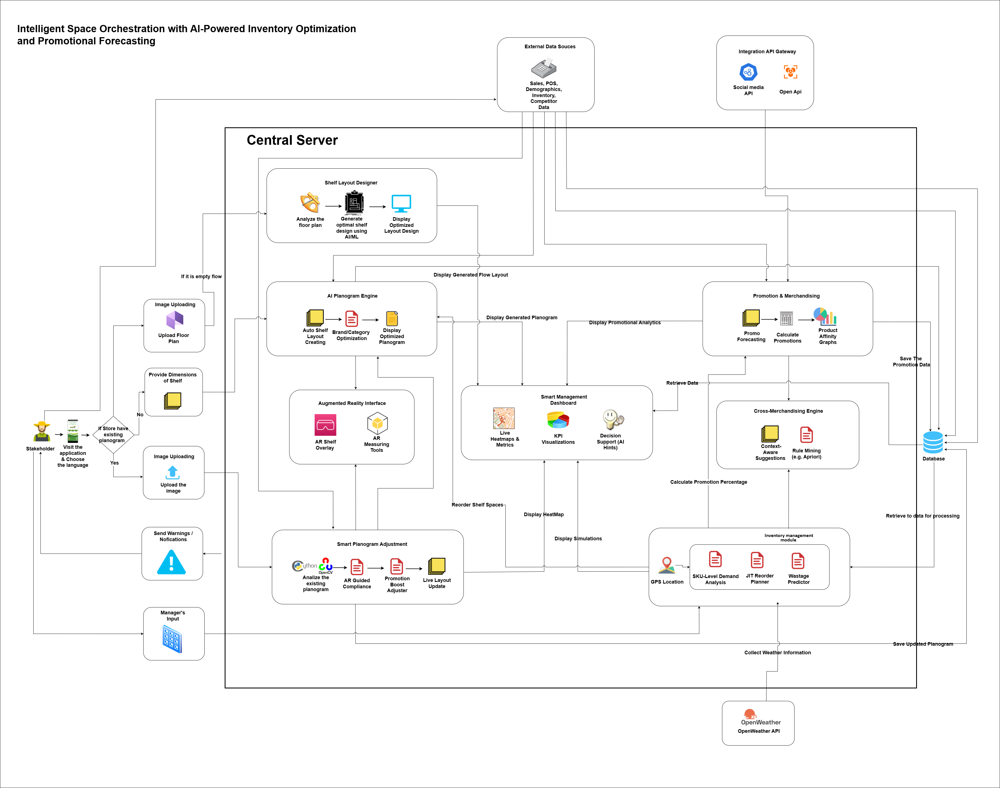

# Planitt

Planitt is an intelligent planning platform for retail, integrating POS, Planogram optimization, and forecasting.

## Project Structure

The solution is organized into several key modules, each serving a specific function within the ecosystem:

*   **PlanogramPlatform**: The core web application for designing and managing planograms.
*   **POS (Point of Sale)**: A dedicated system for handling retail transactions.
*   **MobileApp**: A mobile interface for on-the-go access to platform features.
*   **PythonModels**: A suite of AI/ML services providing intelligence for optimization and forecasting.
*   **Website**: The public-facing landing page and marketing site.

*   **Website**: The public-facing landing page and marketing site.

## Architecture

## Technologies Used

### Frontend Applications
*   **PlanogramPlatform Frontend**: Built with **React** and **Vite**, utilizing **TailwindCSS** for styling and **Radix UI** for accessible components.
*   **POS Frontend**: Built with **React** and **Vite**.
*   **Website**: Built with **React** and **Vite**.
*   **MobileApp**: Built with **React Native** and **Expo**.

### Backend Services
*   **PlanogramPlatform Backend**: **Node.js** with **Express**, using **MongoDB** (Mongoose) for data persistence and integrating with **OpenAI** for advanced AI features.
*   **POS Backend**: **Node.js** with **Express** and **MongoDB**.

### AI & Machine Learning
*   **PythonModels**: hosted using **FastAPI** and **Uvicorn**.
    *   Key Libraries: **Pandas**, **Numpy**, **Scikit-learn**, **XGBoost**, **LightGBM**, **Joblib**.
    *   Services include:
        *   `PlanogramOptimizer`: Optimizes shelf layouts.
        *   `InventoryForecasting`: Predicts stock requirements.
        *   `PromotionForecasting`: Forecasts promotion performance.
        *   `ComplianceChecker`: Validates planogram compliance.

## Getting Started

Please refer to the `README.md` in each subdirectory for specific running instructions.
